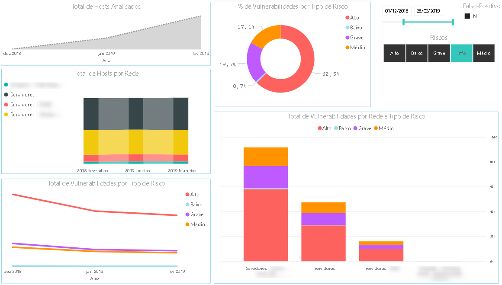
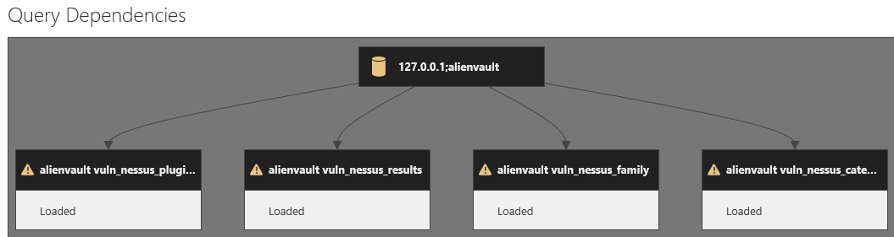
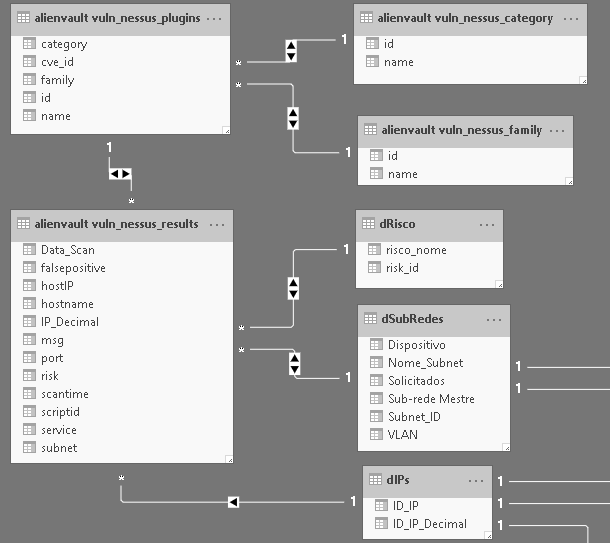

Painel de Segurança com OSSIM e PowerBI
===============================
Para quem usa a ferramenta `AlienVault OSSIM <https://www.alienvault.com/products/ossim>`_
e acha um tanto complicado gerar relatórios utilizando a forma nativa é possível
coletar os dados e montar painéis
no `Microsoft PowerBI Desktop <https://powerbi.microsoft.com>`_ conforme sua necessidade.




    Exemplo de um *dashboard* no PowerBI com dados do OSSIM.


Em resumo, para alcançar isto é necessário:
* **OSSIM** - ferramenta instalada com varreduras já realizadas obviamente
* **Base de Dados** - possuir acesso a base de dados do OSSIM
* **PowerBI** - conhecer a ferramenta para criar relacionamentos entre dados
e personalizar painéis

.. note:: A base de dados utilizada neste tutorial foi em **MySQL**.


Coleta de Dados via Power BI
--------------
Os procedimentos para a coleta dos dados via Power BI.

.. note:: **Usuário/Senha** - recomenda-se uma conta somente de leitura para acesso a base.

 **MySQL** - foi a base de dados utilizada neste tutorial.

* **Driver de Conexão com Banco** - para que o Power BI consiga ler dados do
banco de dados é necessário instalar um conector:
    * **Conector MySQL** - https://dev.mysql.com/downloads/connector/net/


* **Conexão com a Base de Dados** - caso tenha acesso a base pule essa etapa,
porém se deseja acessar a base (restrita somente para o servidor do OSSIM) via
túnel SSH, é necessário:
    * **Resolução de Nome** - alterar a configuração do banco de dados
(```/etc/mysql/my.cnf``), alterando o parâmetro ``skip_name_resolve`` para::
``#skip_name_resolve``.

    * **Túnel SSH** - para acessar a base, que está disponível apenas localmente no servidor, faça uma conexão SSH com o servidor tunelando a porta do MySQL


* **Tabelas e Colunas** - ao conectar na base de dados ``alienvault``, foram
selecionadas algumas tabelas continham informações relevantes (para mim), sendo elas:
    * **alienvault_vuln_nessus_category**
    * **alienvault_vuln_nessus_family** 
    * **alienvault_vuln_nessus_plugins**
    * **alienvault_vuln_nessus_results**




    Tabelas do OSSIM importadas no PowerBI.


Depois de importado os dados e analisado seu conteúdo, observa-se as PKs
(chaves primárias) de forma a criar o relacionamento entre as tabelas.
Abaixo, a visão final de como ficaram os relacionamentos entre as tabelas e
algumas (tabelas e colunas) criadas adicionalmente explicadas logo a seguir.



    Relacionamento de tabelas no PowerBI.

Foram criadas algumas tabelas e colunas para que fosse possível atender a certas
necessidades, sendo elas:

* **Data do Scan** - como a data da varredura estava em um formato que não era
possível hierarquizá-las, foi criada uma nova coluna separando a data na tabela
 `alienvault_vuln_nessus_results` na sintaxe DAX::


    Data_Scan = DATE(
                     LEFT('alienvault vuln_nessus_results'[scantime];4);          //Ano
                     RIGHT(LEFT('alienvault vuln_nessus_results'[scantime];6);2); //Mês
                     RIGHT(LEFT('alienvault vuln_nessus_results'[scantime];8);2)) //Dia


* **SubRedes** - para que fosse possível analisar vulnerabilidade por rede.
Foi criada a nova coluna abaixo utilizando sintaxe DAX::

    subnet = PATHITEM(SUBSTITUTE('alienvault vuln_nessus_results'[hostIP];".";"|");1) & // Primeiro Octeto
             "." &
             PATHITEM(SUBSTITUTE('alienvault vuln_nessus_results'[hostIP];".";"|");2) & // Segundo Octeto
             "." &
             PATHITEM(SUBSTITUTE('alienvault vuln_nessus_results'[hostIP];".";"|");3) & // Terceiro Octeto
             "."
